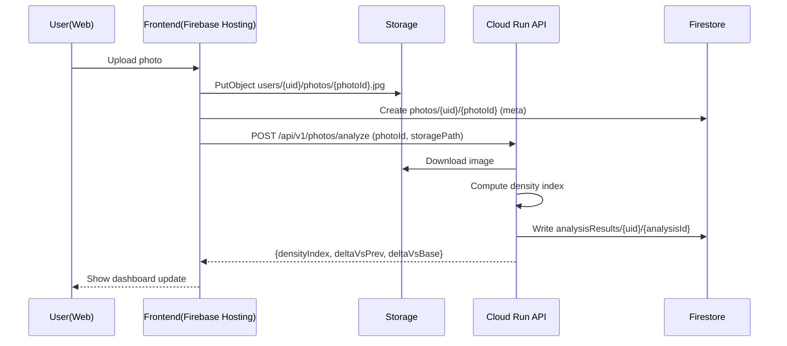
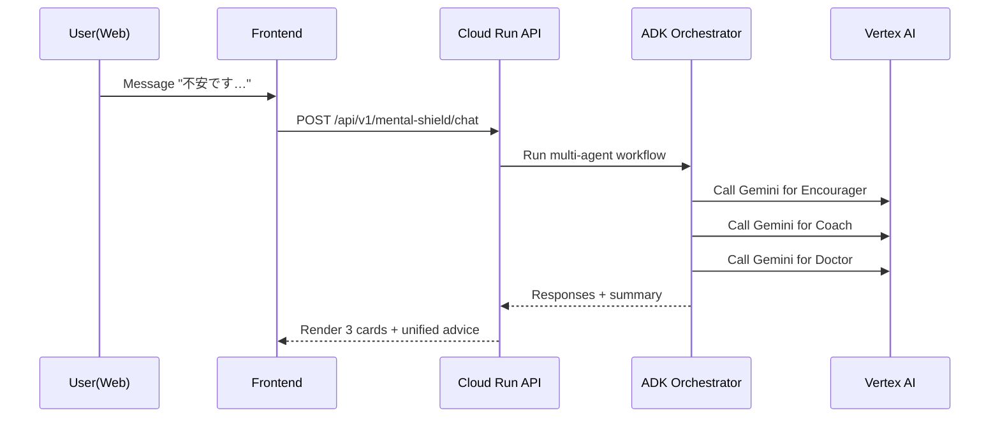

# HairLoss Countermeasure Agent – Blueprint (Firebase + Cloud Run + Vertex AI)

> 目的: 「薄毛対策エージェント」をハッカソン提出レベルまで一気に実装できるように、**ユーザーストーリー / 機能優先度 / アーキテクチャ / デモ構成 / 実装タスク / API設計 / データモデル / エージェント設計**を1つのMDに落とし込む。  
> 前提: Firebase Hosting は既に有効化済み（現状は “Hello Firebase Hosting!” のデフォルトページがデプロイされている状態）  
> - https://hackason-grab.web.app  
> - https://hackason-grab.firebaseapp.com  

---

## 0. エレベーターピッチ（30秒）

**HairGuard Agent** は、薄毛対策の最大の敵である「継続できない」「不安で折れる」「日常の小さな行動に落とせない」を、  
1) **定期写真の進捗トラッキング（髪密度指数）**、  
2) **複数人格エージェントによるメンタル・シールド**、  
3) **帰り道に介入する食材スナイパー**  
の3機能で解決する **“介入型の習慣化エージェント”** です。

---

## 1. ゴール / 非ゴール

### ゴール（勝ち筋）
- **定量化**: 定期写真の時系列比較で「密度+X%」を算出し、ユーザーの継続を支える
- **継続**: 落ち込む瞬間にメンタル介入し、離脱を防ぐ（エージェントの役割分担で“刺さる”言葉を作る）
- **行動**: 日常の帰り道で「買う食材」を決め、ケアを現実行動に落とす
- **ハッカソン要件**:  
  - 実行基盤: **Cloud Run**（またはCloud Functions）  
  - AI: **Vertex AI（Gemini 3）**  
  - Firebase を最大限活用しつつ、要件も確実に満たす

### 非ゴール（安全とスコープ管理）
- 医療行為・診断の提供、薬剤（処方薬）の具体推奨はしない  
- 効果保証をしない（個人差が大きい）  
- “在庫確認”は現実世界の完全自動化が難しいため、MVPでは **推定/確認導線** まで（後述）

---

## 2. ユーザー像（ペルソナ）

### Persona A: 継続が苦手な会社員（メイン）
- 30代 / 毎日忙しい / ケアが続かない
- 悩み: 変化が見えず辞めてしまう、他人に相談できない
- 欲しい価値: 「数値で進捗」「落ち込んだ時に支えてほしい」「今日何をすれば良いか」

### Persona B: 情報過多で不安が強い
- SNSやYouTubeで情報を見すぎて迷走
- 欲しい価値: 信頼できる“整理”と優先順位、危険な情報のブレーキ

### Persona C: 生活改善でやりたい派
- 食事/睡眠/運動から改善したい
- 欲しい価値: 具体的に“買う/食べる/やる”に落としたい

---

## 3. UXの核となるユーザージャーニー

1. **サインイン**（Googleなど）
2. **初回セットアップ**
   - 写真撮影ガイド（撮影角度・光・距離）
   - ベースライン写真アップロード
3. **週次チェックイン**
   - 写真アップロード
   - 画像解析で髪密度指数を算出（ROI内のカバレッジ）
4. **ダッシュボード**
   - 時系列グラフ / Before-After比較 / “+5%” などの定量化
5. **週次レポート**
   - 変化要因の推測（睡眠/ストレス/食事ログがあれば）
   - 次の1週間のToDo（“最小の1手”）
6. **メンタル・シールド**
   - 気分が落ちた時の相談 → 3人格エージェントが分担して支援
7. **食材スナイパー**
   - 帰り道に「今寄れる店 + 今日買う食材」を提案 → 行動に落とす

---

## 4. 機能一覧と優先度（MoSCoW + ハッカソン実装現実）

> 重要: 「提出物として動く」ことが必須なので、**Cloud Run / Vertex AI / Firebase**の接続が通る最小ループを最優先。

### Must（提出MVP）
- **Auth**: Firebase Authentication（Googleログイン）
- **写真アップロード**: Firebase Storage へアップロード + Firestore にメタ
- **進捗トラッキング & 分析**（機能1の中核）
  - ROI（頭頂部など）の髪密度指数算出
  - 時系列保存（Firestore）
  - ダッシュボード表示（増減%）
- **レポート生成**（機能1の価値増幅）
  - Vertex AI（Gemini）で自然言語レポート生成
- **API基盤**: Firebase Hosting → Cloud Run への rewrite で `/api/**` を提供

### Should（受賞確度UP）
- **メンタル・シールド**（機能2）
  - ADKで3人格エージェント（励まし/鬼コーチ/医学博士）をオーケストレーション
  - 会話ログ保存、簡易メモリ（直近Nターン）
  - 医療安全ガード（診断しない・受診勧告）

### Could（差別化の“エージェントっぽさ”）
- **食材スナイパー**（機能3）
  - 位置情報→近隣店舗候補→“髪に良さそうな食材”の提案
  - 在庫は **MVPでは「確度/確認導線」**（例: “確度高: コンビニ/スーパーで入手しやすい”）
  - 次アクション: “買い物リスト”生成、リマインド

### Won’t（ハッカソンでは切る）
- 継続課金/決済
- 医学的診断モデルの学習
- 店舗のリアル在庫APIの完全統合（現実的に難度が高い）

---

## 5. ユーザーストーリー（Acceptance Criteria付き）

### Epic 1: アカウント & プロフィール
1. **US-1**: ユーザーとして、Googleでログインして自分のデータを安全に扱いたい  
   - ✅ 受入条件
     - Firebase Authでログインできる
     - 未ログイン時は写真/ダッシュボードにアクセス不可
2. **US-2**: ユーザーとして、撮影の頻度（例: 週1）を設定したい  
   - ✅ 受入条件
     - Firestore `users/{uid}` に `checkinCadence` が保存される

### Epic 2: 写真アップロード & 保存
3. **US-3**: ユーザーとして、ガイドに沿って頭頂部の写真を撮ってアップロードしたい  
   - ✅ 受入条件
     - 画像プレビュー、再撮影、アップロードできる
     - Storage に `users/{uid}/photos/{photoId}.jpg` で保存される
     - Firestore に photo メタ（撮影日時/デバイス/角度メモ）が保存される
4. **US-4**: ユーザーとして、撮影品質が悪い場合はリテイクを促してほしい  
   - ✅ 受入条件
     - “暗い/ブレ/顔が写っている/ROIがずれている”を検知し警告（簡易でOK）

### Epic 3: 画像解析 → 進捗指数
5. **US-5**: ユーザーとして、アップした写真から髪密度指数を自動算出してほしい  
   - ✅ 受入条件
     - Cloud Run `/api/v1/photos/analyze` を呼ぶと解析結果が返る
     - Firestore に `analysisResults` が保存される
6. **US-6**: ユーザーとして、前回比・ベースライン比が数値で見たい  
   - ✅ 受入条件
     - “前回比 +X% / ベースライン比 +Y%” を計算して表示

### Epic 4: 進捗ダッシュボード & レポート
7. **US-7**: ユーザーとして、時系列で進捗が見たい  
   - ✅ 受入条件
     - 日付順に一覧、グラフ表示（最低限折れ線）
8. **US-8**: ユーザーとして、週次で分析レポートがほしい  
   - ✅ 受入条件
     - `/api/v1/reports/generate` で最新データからレポート生成
     - Geminiが「今週の変化」「良かった点」「次週の小さな一手」を出す

### Epic 5: メンタル・シールド（ADKマルチエージェント）
9. **US-9**: ユーザーとして、落ち込んだ時に励まし・叱咤・医学的整理を受けたい  
   - ✅ 受入条件
     - 3人格が順に短い返答を出す（または最終統合回答を出す）
     - “診断しない/危険助言しない/受診推奨” が守られる
10. **US-10**: ユーザーとして、会話が次回も続く感じがほしい  
   - ✅ 受入条件
     - 会話ログが Firestore に保存され、直近Nターンをコンテキストに渡す

### Epic 6: 食材スナイパー（ツール呼び出し）
11. **US-11**: ユーザーとして「帰りにレバー買って」と言うだけで、近くの店と理由を提案してほしい  
   - ✅ 受入条件
     - 位置情報（lat/lng）を受け取り、近隣店舗候補を返す（MVPはダミーでもOK）
     - “なぜその食材が良いか” を短く説明（一般論）
12. **US-12**: ユーザーとして、買い物リストが欲しい  
   - ✅ 受入条件
     - “今日買うもの” がチェックリストで出る
     - Firestore に保存される（翌日見返せる）

---

## 6. アーキテクチャ（Firebaseを活かす構成）

### 6.1 全体像（推奨）
- **Frontend**: Firebase Hosting（Next.js / React）
- **Auth**: Firebase Authentication
- **DB**: Firestore
- **File**: Firebase Storage（写真）
- **Backend API**: Cloud Run（FastAPI / Node）  
  - Vertex AI（Gemini 3）呼び出し
  - 画像解析（OpenCV など）
  - ADK マルチエージェント（メンタル・シールド）
- **非同期**（任意）: Cloud Functions（Storage/Firestore トリガー） or Cloud Tasks

> “Firebaseを作った”状態から最短でハッカソン要件（実行基盤＋AI）も満たせる。

### 6.2 図（Mermaid）

```mermaid
flowchart LR
  U[User] -->|HTTPS| FH[Firebase Hosting\n(Next.js)]
  FH -->|ID Token| AUTH[Firebase Auth]
  FH -->|Upload photo| ST[Firebase Storage]
  FH -->|Read/Write| FS[Firestore]

  FH -->|/api/* rewrite| CR[Cloud Run: agent-api]
  CR -->|Verify token| AUTH
  CR -->|Read photo| ST
  CR -->|Store result| FS

  CR -->|Generate report / Agent reasoning| VAI[Vertex AI\nGemini 3]
  CR -->|Multi-agent orchestration| ADK[ADK runtime\n(in Cloud Run)]
```

### 6.3 主要データフロー

#### 写真解析フロー


#### メンタル・シールド（マルチエージェント）フロー


---

## 7. Firebase（Firestore/Storage）データモデル案

### 7.1 コレクション設計

#### users/{uid}
```json
{
  "displayName": "Taro",
  "createdAt": "2026-01-28T00:00:00Z",
  "checkinCadence": "weekly",
  "roiPreset": "crown",
  "agentMode": "balanced"
}
```

#### photos/{uid}/items/{photoId}
```json
{
  "storagePath": "users/{uid}/photos/{photoId}.jpg",
  "capturedAt": "2026-01-28T09:00:00Z",
  "createdAt": "2026-01-28T09:01:00Z",
  "quality": { "score": 0.82, "warnings": ["low_light"] },
  "status": "uploaded"  // uploaded|analyzing|done|failed
}
```

#### analysisResults/{uid}/items/{analysisId}
```json
{
  "photoId": "photo_123",
  "computedAt": "2026-01-28T09:02:10Z",
  "roi": { "x": 0.2, "y": 0.2, "w": 0.6, "h": 0.6 },
  "densityIndex": 0.41,
  "deltaVsPrev": 0.05,
  "deltaVsBase": 0.05,
  "method": "opencv_coverage_v1",
  "notes": "lighting adjusted"
}
```

#### reports/{uid}/items/{reportId}
```json
{
  "createdAt": "2026-02-02T00:00:00Z",
  "period": { "from": "2026-01-26", "to": "2026-02-02" },
  "highlights": [
    "髪密度指数は前週比で +3% でした",
    "撮影品質が安定してきています"
  ],
  "nextActions": [
    "週2回、就寝1時間前のスマホ断ち",
    "鉄/亜鉛を意識してレバーor卵を1品追加"
  ],
  "llm": { "model": "gemini-3-flash", "promptVersion": "report_v1" }
}
```

#### conversations/{uid}/threads/{threadId}/messages/{msgId}
```json
{
  "role": "user|agent",
  "agent": "encourager|coach|doctor|orchestrator",
  "text": "…",
  "createdAt": "2026-01-28T09:10:00Z"
}
```

#### foodRequests/{uid}/items/{reqId}
```json
{
  "createdAt": "2026-01-28T18:30:00Z",
  "query": "焼き鳥レバー買って",
  "location": { "lat": 35.0, "lng": 139.0, "accuracyM": 40 },
  "recommendations": [
    { "storeName": "スーパーA", "distanceM": 240, "confidence": 0.72, "why": "レバーが手に入りやすい" }
  ]
}
```

### 7.2 Security Rules（方針）
- Firestore/Storage ともに **uid一致** を基本に読み書きを制限
- location や写真はセンシティブ → **公開ルール禁止**
- Backend（Cloud Run）は Admin SDK でアクセス

---

## 8. Cloud Run API（FastAPI例） – エンドポイント設計

> 目標: フロントが “Firebaseだけ” で完結しがちなところに、Cloud Run を挟んで **AIと解析** を実現する。

### 認証（共通）
- フロント: `firebase/auth` で ID Token 取得
- API: `Authorization: Bearer <ID_TOKEN>` を受け取り、Firebase Admin で検証

---

### 8.1 POST /api/v1/photos/analyze
**目的**: Storage 上の写真を解析し、髪密度指数を保存して返す

#### Request
```json
{
  "photoId": "photo_123",
  "storagePath": "users/{uid}/photos/photo_123.jpg",
  "capturedAt": "2026-01-28T09:00:00Z",
  "roiPreset": "crown"
}
```

#### Response
```json
{
  "densityIndex": 0.41,
  "deltaVsPrev": 0.05,
  "deltaVsBase": 0.05,
  "quality": { "score": 0.82, "warnings": ["low_light"] },
  "analysisId": "analysis_456"
}
```

---

### 8.2 GET /api/v1/progress
**目的**: 期間の分析結果をまとめて返す（グラフ描画用）

#### Response
```json
{
  "series": [
    { "date": "2026-01-21", "densityIndex": 0.39 },
    { "date": "2026-01-28", "densityIndex": 0.41 }
  ]
}
```

---

### 8.3 POST /api/v1/reports/generate
**目的**: 直近N件の分析結果から週次レポートを生成（Gemini）

#### Request
```json
{ "periodDays": 7 }
```

#### Response
```json
{
  "reportId": "report_789",
  "highlights": ["..."],
  "nextActions": ["..."],
  "rawText": "..."
}
```

---

### 8.4 POST /api/v1/mental-shield/chat
**目的**: ADKで3人格が支援（励まし/鬼コーチ/医学博士）

#### Request
```json
{
  "threadId": "default",
  "message": "最近抜け毛が増えた気がして辛い",
  "mode": "balanced"
}
```

#### Response
```json
{
  "cards": [
    { "agent": "encourager", "text": "..." },
    { "agent": "coach", "text": "..." },
    { "agent": "doctor", "text": "..." }
  ],
  "summary": "今日の最小の一手は...",
  "threadId": "default"
}
```

---

### 8.5 POST /api/v1/food-sniper/recommend
**目的**: 位置情報 + ユーザー発話から“買う食材”と“寄れる店”を提案

#### Request
```json
{
  "message": "帰りに焼き鳥レバー買って",
  "location": { "lat": 35.0, "lng": 139.0 },
  "radiusM": 800
}
```

#### Response
```json
{
  "items": [
    { "name": "レバー", "why": "鉄・ビタミンB群など（一般論）" },
    { "name": "卵", "why": "タンパク質の取りやすさ（一般論）" }
  ],
  "stores": [
    { "name": "スーパーA", "distanceM": 240, "confidence": 0.72, "note": "惣菜/精肉ありそう" },
    { "name": "コンビニB", "distanceM": 120, "confidence": 0.55, "note": "確実性は低いので代替提案" }
  ],
  "shoppingList": ["レバー（または卵）", "ナッツ小袋"]
}
```

---

## 9. 画像解析（髪密度指数）のMVPアルゴリズム案

> 重要: “医療の正確な密度測定”ではなく、**同条件の写真での相対比較**を主眼にする。

### 9.1 前提（UXで精度を稼ぐ）
- 撮影ガイド（光 / 距離 / 角度）をUIで強制  
- ROI（頭頂部）を固定し、毎回同じ位置に合わせる  
- 撮影品質が悪い場合は “リテイク” を促す（簡易判定でOK）

### 9.2 カバレッジ指標（OpenCV）
1. 画像を一定サイズに正規化
2. ROIを切り出し
3. HSV/LAB などで“髪（暗い領域）”と“頭皮（明るい領域）”を二値化
4. ノイズ除去（モルフォロジー）
5. `hair_pixels / total_pixels` を densityIndex とする

> これで「同じ人の同条件の比較」に強い、**継続モチベーションの数値**になる。

### 9.3 追加（余力があれば）
- Gemini Vision で「写真品質スコア」を出す（ブレ、暗さ、顔写り等）
- ROIの自動推定（簡易: 顔検出→頭頂推定、もしくはユーザーの手動ROI保存）

---

## 10. メンタル・シールド（ADK）設計

### 10.1 役割分担（3人格）
- **Encourager（励まし役）**: 共感・継続を支える。短く温かい。  
- **Coach（鬼コーチ役）**: “やること”を一つに絞り、行動を促す。厳しいが安全。  
- **Doctor（医学博士役）**: 医学情報を整理し、危険な誤解を正す。診断しない。受診推奨含む。

### 10.2 安全ガード（必須）
- Doctor は **診断しない**（例: “AGAです”と言わない）
- 体調悪化/急な脱毛/皮膚症状などは受診推奨
- 薬剤の具体名（フィナステリド等）を強く推奨しない（一般論＋医師へ）

### 10.3 オーケストレーション（案）
- Orchestrator がユーザー入力を読み、3人格に同じコンテキストを配布
- 3人格の回答を短くまとめて “今日の最小の一手” を提示
- 会話ログ（直近10ターン）を Firestore から取り、コンテキストに入れる

---

## 11. 食材スナイパー（Function Calling / Tooling）設計

### 11.1 MVPの割り切り
- 位置情報 → 近隣店舗検索 → “買いやすさ” を推定  
- 在庫確認は **確度（confidence）** と **代替案** を提示
- 将来: 店舗API/ユーザー報告で在庫推定を改善

### 11.2 ツール関数（例）
- `get_nearby_stores(lat, lng, radiusM)`  
  - MVP: Firestore に “店舗ダミーデータ” を持つ、または固定JSON
- `rank_food_items_for_goal(goal="hair")`  
  - タンパク質・鉄・亜鉛など一般論でランキング
- `build_shopping_list(items, constraints)`  
  - “コンビニでも買える代替” を必ず出す

---

## 12. デモ構成（3分動画想定の台本）

> 3分で「課題→解決→体験→技術」を見せ切る。

### 0:00–0:20 問題提起（1枚スライドでもOK）
- “薄毛対策は **継続が最難関**”
- 変化が見えない、メンタルが折れる、行動が続かない

### 0:20–1:20 機能1：進捗トラッキング＆分析レポート
- Baseline写真 → 今週写真をアップ
- ダッシュボードで **密度+5%** の表示
- 週次レポートが「次の一手」を提案（Gemini生成）

### 1:20–2:20 機能2：メンタル・シールド（3人格）
- ユーザー: “落ち込む…”
- 励まし/鬼コーチ/医学博士の3カードが出る
- まとめで “今日の最小の一手” を提示

### 2:20–2:50 機能3：食材スナイパー
- ユーザー: “帰りにレバー買って”
- 近所の店候補 + “代替案（卵/ナッツ）” + 買い物リスト

### 2:50–3:00 技術まとめ（アーキ図）
- Firebase（Auth/Firestore/Storage/Hosting） + Cloud Run + Vertex AI(Gemini 3) + ADK  
- “エージェントとして自律的にツールを呼ぶ” を強調

---

## 13. 実装タスク（Vibe Coding用のチケット分割）

> 下から順に潰すと、提出可能な “動くMVP” が最短で完成します。

### Phase 0: 下地
- [ ] Repo をモノレポ化（例）
  - `apps/web`（Next.js）
  - `services/agent-api`（FastAPI + ADK）
- [ ] Firebase プロジェクトに Firestore/Storage を有効化
- [ ] ローカルで Firebase Emulator を起動（任意）

### Phase 1: フロント（写真→保存→解析呼び出し）
- [ ] Firebase Auth（Googleログイン）導入
- [ ] 写真アップロードUI（プレビュー/再撮影）
- [ ] Storage にアップロード
- [ ] Firestore に photo メタ保存
- [ ] Cloud Run API に `/photos/analyze` を叩く（ID token付き）
- [ ] 結果を Firestore に保存 & 画面に表示

### Phase 2: Cloud Run API（解析）
- [ ] FastAPI 立ち上げ（ヘルスチェック）
- [ ] Firebase Admin で ID token 検証
- [ ] Storage から画像ダウンロード
- [ ] OpenCV で densityIndex 算出
- [ ] Firestore 書き込み

### Phase 3: レポート（Gemini）
- [ ] `/reports/generate` 実装
- [ ] Firestore から直近N件の分析を取得
- [ ] Gemini に渡すプロンプト設計（短く、構造化）
- [ ] Firestore にレポート保存 & 画面表示

### Phase 4: メンタル・シールド（ADK）
- [ ] ADK を Cloud Run コンテナに組み込み
- [ ] 3エージェント + orchestrator 実装
- [ ] `/mental-shield/chat` 実装
- [ ] 会話ログ保存、直近Nターン読み込み

### Phase 5: 食材スナイパー（最低限）
- [ ] ブラウザで位置情報取得（ユーザー許可）
- [ ] `/food-sniper/recommend` 実装（ダミー店舗でもOK）
- [ ] 店舗候補 + 代替案 + 買い物リスト
- [ ] Firestore に保存

---

## 14. 実装スケルトン（構成例）

### 14.1 ディレクトリ
```
repo/
  apps/
    web/
      src/
        app/
        components/
        lib/firebase.ts
  services/
    agent-api/
      app/
        main.py
        auth.py
        firestore.py
        storage.py
        analysis/hair_density.py
        llm/vertex_gemini.py
        agents/mental_shield.py
        agents/tools.py
      Dockerfile
      requirements.txt
  firebase.json
  .firebaserc
```

### 14.2 firebase.json（Cloud Run への rewrite例）
> Hosting の URL 配下で API を提供する。CORS地獄を避ける。

```json
{
  "hosting": {
    "public": "apps/web/out",
    "rewrites": [
      {
        "source": "/api/**",
        "run": {
          "serviceId": "agent-api",
          "region": "asia-northeast1"
        }
      }
    ]
  }
}
```

---

## 15. Vibe Coding 用プロンプト（コピペして実装を進める）

> ここは “そのままLLMに貼ってコード生成” できる粒度で書きます。

### Prompt A: Next.js + Firebase Auth + Storage Upload
- 目的: `apps/web` でログイン、写真アップ、Firestore保存まで
- 入力: TypeScript / Next.js app router を想定

**プロンプト（コピペ用）**
```text
あなたはシニアフルスタックエンジニアです。
Next.js (App Router) + TypeScript で、Firebase Authentication (Google) と Firebase Storage + Firestore を使った写真アップロード機能を実装してください。

要件:
- ログインしていない場合は /login にリダイレクト
- /checkin ページで画像を選択→プレビュー→アップロード
- Storage: users/{uid}/photos/{photoId}.jpg に保存
- Firestore: photos/{uid}/items/{photoId} に {storagePath, capturedAt, createdAt, status:"uploaded"} を保存
- アップロード成功後、/api/v1/photos/analyze を呼び出す（Authorization: Bearer <Firebase ID token>）
- 解析レスポンスを受け取ったら Firestore analysisResults/{uid}/items/{analysisId} に保存し、画面に表示
- firebase client 初期化コード、UIコンポーネント、呼び出し関数をファイル分割して提示
```

### Prompt B: Cloud Run FastAPI – Firebase ID token verify + Storage download + OpenCV解析
```text
Python FastAPI で /api/v1/photos/analyze を実装してください。
- Authorization Bearer の Firebase ID token を Firebase Admin SDK で検証して uid を取得
- リクエスト JSON: {photoId, storagePath, capturedAt, roiPreset}
- Google Cloud Storage (Firebase Storage bucket) から storagePath の画像をダウンロード
- OpenCV を使って ROI 内の髪密度指数 densityIndex を算出（暗い領域比率の簡易方式でOK）
- Firestore に analysisResults/{uid}/items/{analysisId} を書き込む
- 前回分析とベースラインの densityIndex を Firestore から取得して delta を計算
- レスポンス JSON: {densityIndex, deltaVsPrev, deltaVsBase, quality, analysisId}
- 必要なファイル: main.py, auth.py, storage.py, analysis/hair_density.py を作成し、requirements.txt も提示
```

### Prompt C: Vertex AI Gemini で週次レポート
```text
FastAPI の /api/v1/reports/generate を追加実装してください。
- Firestore から直近7日（または直近N件）の analysisResults を取得
- Gemini へ渡すプロンプトは JSON で構造化し、出力も JSON で返すよう指示
- 出力項目: highlights[], nextActions[], rawText
- 結果を Firestore reports/{uid}/items/{reportId} に保存
- モデル名やリージョンは環境変数で差し替え可能にする
```

### Prompt D: ADK で3人格（Encourager/Coach/Doctor） + orchestrator
```text
ADK (Agent Development Kit) を使って、3人格のエージェントをオーケストレーションする構成を Python で作ってください。
- Encourager: 共感と継続支援（短く）
- Coach: 行動を1つに絞る（短く厳しく）
- Doctor: 医療情報の整理、診断しない、受診勧告（安全ガード必須）
- Orchestrator: ユーザー入力と会話履歴(直近10ターン)を配布し、3人格の回答と summary を返す
- /api/v1/mental-shield/chat から呼び出せる関数 mental_shield_chat(uid, threadId, message) を実装
- Firestore に会話ログを保存
```

### Prompt E: Food Sniper（ツール呼び出し + 代替案）
```text
FastAPI に /api/v1/food-sniper/recommend を実装してください。
- 入力: message, location{lat,lng}, radiusM
- まず message から食材候補を抽出し、髪の健康に良い一般論の理由を付ける
- 近隣店舗は MVP として固定のダミーデータ（距離計算あり）で返してよい
- 在庫確認はできない前提で confidence と代替案を必ず提示
- Firestore foodRequests/{uid}/items/{reqId} に保存
```

---

## 16. ハッカソン提出チェックリスト（抜け漏れ防止）
- [ ] Cloud Run（または Cloud Functions）を使っている（実行基盤）
- [ ] Vertex AI / Gemini API / ADK を使っている（AI）
- [ ] GitHub 公開リポジトリ URL
- [ ] デプロイ URL（Firebase Hosting + Cloud Run API）
- [ ] Zenn 記事（Ideaカテゴリ + gch4トピック）
- [ ] アーキテクチャ図（このMermaidを画像化して貼れる）
- [ ] 3分デモ動画（YouTube）

---

## 17. リスクと対策（現実的に詰まりやすい）
- **撮影条件ブレ** → UIガイド + 品質判定 + リテイク導線
- **医療助言リスク** → Doctorに安全ガード + 受診推奨 + 断定禁止
- **コスト/キー漏洩** → Vertex AI は Cloud Run 側で呼ぶ（フロントにキーを置かない）
- **締切直前の壊れ** → Git tag 固定、提出版の URL と commit をロック

---

## 18. 次にやること（最短の行動）
1. `apps/web` を Next.js で作り、Firebase Auth + Upload を通す  
2. `services/agent-api` を FastAPI で作り、/photos/analyze を通す  
3. Firebase Hosting → Cloud Run rewrite を設定して “同一ドメインで API” を動かす  
4. レポート（Gemini）→ メンタル（ADK）→ 食材（ダミー）を順に足す

---

以上。  
このMDをそのままタスクボード化し、上の Prompt 群を使って “vibe coding” で実装を進めれば、提出物（動くURL・動画・記事）まで到達できます。
