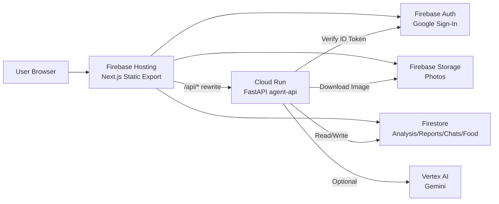

# HairGuard Agent システム仕様書

最終更新: 2026-01-29

## 1. 概要
薄毛対策の継続を支えるMVP。  
Firebase Hosting + Cloud Run + Firebase（Auth/Firestore/Storage）を中心に構成し、レポート/メンタル支援は Vertex AI（Gemini）連携に対応。

---

## 2. システム構成 / アーキテクチャ



### 2.1 実行基盤
- フロント: Next.js（Static Export）を Firebase Hosting へデプロイ
- API: Cloud Run `agent-api` (region: `asia-northeast1`)
- AI: Vertex AI（Gemini）/ ルールベースのフォールバック

### 2.2 リライト設定
`firebase.json` の `hosting.rewrites` により `/api/**` を Cloud Run に転送。

---

## 3. フロントエンド

### 3.1 技術
- Next.js 16 (App Router)
- Firebase Web SDK（Auth/Firestore/Storage）
- Static Export (`output: "export"`)

### 3.2 画面一覧
| 画面 | パス | 概要 |
|---|---|---|
| Home | `/` | MVP概要と導線 |
| Login | `/login` | Googleログイン |
| Check-in | `/checkin` | 写真アップロード & 解析起動 |
| Dashboard | `/dashboard` | 進捗グラフ / 週次レポート |
| Mental Shield | `/mental-shield` | 3人格の相談回答 |
| Food Sniper | `/food-sniper` | 食材 & 店舗提案 + 履歴 |

### 3.3 フロント環境変数（例）
`.env.local` もしくは GitHub Actions Secrets で設定。
- `NEXT_PUBLIC_FIREBASE_API_KEY`
- `NEXT_PUBLIC_FIREBASE_AUTH_DOMAIN`
- `NEXT_PUBLIC_FIREBASE_PROJECT_ID`
- `NEXT_PUBLIC_FIREBASE_STORAGE_BUCKET`
- `NEXT_PUBLIC_FIREBASE_MESSAGING_SENDER_ID`
- `NEXT_PUBLIC_FIREBASE_APP_ID`
- `NEXT_PUBLIC_API_BASE`（Cloud Run URL）

---

## 4. バックエンド（Cloud Run / FastAPI）

### 4.1 認証
全 API は Firebase ID Token を `Authorization: Bearer <token>` で検証。

### 4.2 エンドポイント一覧
| メソッド | パス | 説明 | 認証 |
|---|---|---|---|
| GET | `/api/health` | ヘルスチェック | 不要 |
| POST | `/api/v1/photos/analyze` | 画像解析（髪密度指数） | 必須 |
| POST | `/api/v1/reports/generate` | 週次レポート生成 | 必須 |
| POST | `/api/v1/mental-shield/chat` | 3人格メンタル支援 | 必須 |
| POST | `/api/v1/food-sniper/recommend` | 食材/店舗提案 | 必須 |

### 4.3 主要リクエスト/レスポンス概要
- `/api/v1/photos/analyze`
  - 入力: `photoId`, `storagePath`, `capturedAt`, `roiPreset`
  - 出力: `densityIndex`, `deltaVsPrev`, `deltaVsBase`, `quality`, `analysisId`
- `/api/v1/reports/generate`
  - 入力: `periodDays`
  - 出力: `highlights`, `nextActions`, `rawText`
- `/api/v1/mental-shield/chat`
  - 入力: `threadId`, `message`, `mode`
  - 出力: `cards[{agent,text}]`, `summary`
- `/api/v1/food-sniper/recommend`
  - 入力: `message`, `location{lat,lng,accuracyM}`, `radiusM`
  - 出力: `items`, `stores`, `shoppingList`

### 4.4 バックエンド環境変数
Cloud Run 環境変数として設定。
- `FIREBASE_STORAGE_BUCKET`（必須）
- `FIREBASE_PROJECT_ID`
- `ALLOWED_ORIGINS`（CORS許可）
- `DEBUG_AUTH`（true/false）
- `GOOGLE_CLOUD_PROJECT`（Vertex AI用）
- `GOOGLE_CLOUD_LOCATION`（例: `global`）
- `GOOGLE_GENAI_USE_VERTEXAI`（true/false）
- `GEMINI_MODEL`（例: `gemini-2.5-flash`）
- `GEMINI_ENABLED`（true/false）

---

## 5. データストア設計（Firestore / Storage）

### 5.1 Firestore コレクション
```
users/{uid}
photos/{uid}/items/{photoId}
analysisResults/{uid}/items/{analysisId}
reports/{uid}/items/{reportId}
conversations/{uid}/threads/{threadId}/messages/{messageId}
foodRequests/{uid}/items/{requestId}
```

### 5.2 Storage
```
users/{uid}/photos/{photoId}.jpg
```

### 5.3 ルール
- `firestore.rules`: 全て `request.auth.uid == uid` のみ許可
- `storage.rules`: `users/{uid}/photos/*` のみ許可

---

## 6. 機能一覧（要約）
- 写真チェックイン（Storage + 解析API）
- 密度指数の時系列可視化（Dashboard）
- 週次レポート（Gemini or ルール）
- メンタル・シールド（3人格）
- 食材スナイパー（位置情報ベースの提案 + 履歴）

---

## 7. フォルダ構成（主要）
```
hackason-grab/
├─ apps/
│  └─ web/                # Next.js (フロント)
│     ├─ src/app/         # 画面実装
│     ├─ src/lib/         # Firebase初期化
│     └─ .env.local       # ローカル環境変数
├─ services/
│  └─ agent-api/          # FastAPI (Cloud Run)
│     ├─ app/             # API実装
│     └─ requirements.txt
├─ firestore.rules
├─ storage.rules
├─ firebase.json
└─ doc/                   # 本仕様書
```

---

## 8. デプロイ/CI
- Firebase Hosting: GitHub Actions `firebase-hosting-merge.yml`  
  - `npm ci --prefix apps/web` → `npm --prefix apps/web run build`  
  - `FirebaseExtended/action-hosting-deploy@v0`
- Cloud Run: `gcloud run deploy agent-api --source services/agent-api`
